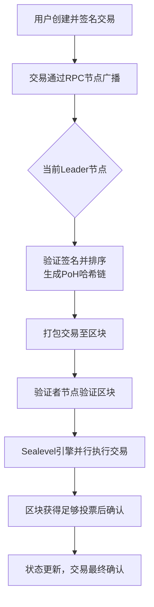

solana 交易过程


leader 节点：在一个特定的时间段（Slot，约400毫秒） 内，全网只有一个指定的Leader节点,不负责最终确认交易,只给出下一个区块应该包含哪些交易以及顺序
1. 接收交易：从用户或RPC节点处接收交易
2. 排序与打包：使用pof为这些交易生成一个可验证的时间序列，然后将它们打包成一个区块。
3. 广播区块：将打包好的区块广播给网络中的所有其他验证者节点进行验证。

leader：4个块乱换一次，验证节点也可能成为leader节点

通过pos和poh 确定未来一段时间的区块由谁产出以及产出顺序

用户发起交易，钱包会使用私钥签名，发到网络上，由验证节点接收
验证节点验证交易有效性（签名，余额，区块检查等），所有的leader都是验证节点，
但是不是所有的验证节点都是leader节点


poh：大概思路，和比特币的hash指针类似
    sha256("创世区块")   --->   hash1
    sha256(hash1)      --->    hash2
    .....
    sha256(hash99)     --->    hash100


高效、无拥塞：避免了全网节点同时处理大量无效交易，减少了网络拥堵，为并行处理（Sealevel）奠定了基础


BPF 给每个程序提供沙盒环境，提前处理好冲突，并行执行无冲突的不分
EVM 串行执行


solana 中一切皆 账户
```rust
pub struct Account {
    /// lamports in the account
    pub lamports: u64,
    /// data held in this account
    #[serde(with = "serde_bytes")]
    pub data: Vec<u8>,
    /// the program that owns this account. If executable, the program that loads this account.
    pub owner: Pubkey,
    /// this account's data contains a loaded program (and is now read-only)
    pub executable: bool,
    /// 与租金机制相关，记录下一个需要支付租金的纪元
    pub rent_epoch: Epoch,
}
```
